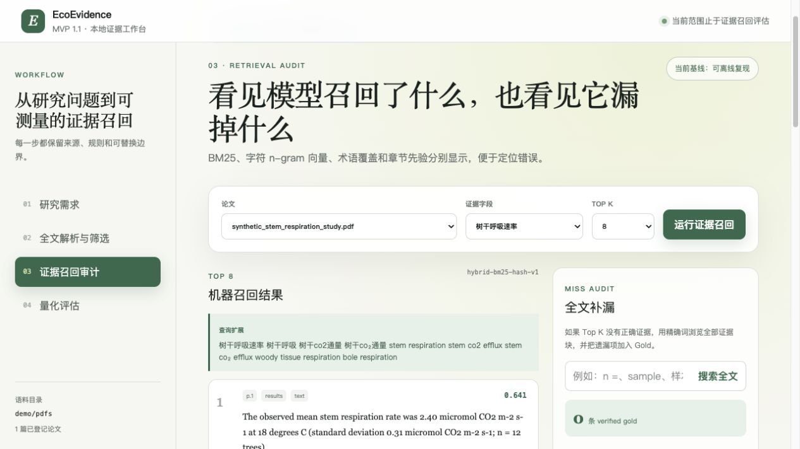

# EcoEvidence: Literature-to-Data Evidence Workbench

> 面向科研人员的本地 PDF 全文解析、可追溯证据召回与人工评测工作台。当前公开 Demo 聚焦 Literature-to-Data 流程中最关键的“证据定位与验证”环节。

EcoEvidence 将研究需求拆解为字段 Schema，解析 PDF 全文并生成带页码与坐标的证据块，再用可解释的混合检索返回候选证据。审核者可以标记 Gold evidence，并用 Hit@K、Recall@K、Precision@K 和 MRR 评估召回效果。

仓库内附一篇完全虚构、可公开的生态学论文 PDF。新用户无需准备私人论文即可跑通 Demo。



## 30 秒了解项目

| 问题 | 回答 |
| --- | --- |
| 解决什么问题？ | 长文档直接交给 LLM 噪声高、成本高，且最终数据难以回链到原始证据。 |
| 输入是什么？ | 自然语言研究需求，以及本地 PDF 文献目录。 |
| 输出是什么？ | 文献筛选状态、Top-K 证据块、页码/章节/坐标、Gold evidence 和召回指标。 |
| 当前可运行到哪里？ | PDF 全文解析 → 规则筛选 → 混合召回 → 人工标注 → 量化评估。 |
| 数据是否上传？ | 否。PDF、SQLite 数据库和人工审核结果默认只保存在本地。 |

## 功能状态

### 已实现并可运行

- 将自然语言需求拆解为目标变量、必须字段、关注字段、来源和排除规则。
- 使用版本化 `pdfplumber-reading-order-v2` 解析 PDF 文本层，修复常见双栏
  阅读顺序、重复页眉页脚、跨行英文断词、科学下标和中英文断行问题。
- 将父段切成适合检索的 child chunk；排序命中 child 后返回完整父段上下文，
  并保留页码、章节、原始文本、PDF 坐标和稳定 block ID。
- 生成实验性的图表概况，记录图/表/图像候选的页码、caption、bbox、检测
  方法、置信度和待数字化状态；当前不声称理解图像或已完成数值数字化。
- 使用 BM25、字符 n-gram hashing 向量相似度、术语覆盖和章节先验进行可解释的混合召回。
- 使用可替换、带版本元数据的 Embedding backend 契约运行召回；提供固定 revision 的本地 `multilingual-e5-small` 神经 backend，默认仍是离线 hashing baseline，并记录模型标识、运行时参数和耗时。
- 使用 SQLite 持久化证据块向量，并用文档、文本、backend、模型、参数和维度的组合哈希防止静默复用过期向量。
- 在“证据召回审计”中对同一论文、字段和 Gold 并排比较 BM25-only、hashing hybrid 与 E5 hybrid，显示排名变化、分数组成、Hit/Recall、首次 Gold 排名、版本和耗时；未安装神经运行时时另外两路仍可用。
- 支持 `usable`、`relative`、`nodata`、`failed` 四级筛选。
- 支持人工标记 verified Gold evidence，并计算 Hit@K、Recall@K、Precision@K、MRR。
- 使用 SQLite 保存本地状态，并以 PDF 哈希复用解析结果。

### 实验中 / 下一步

- 扩大冻结 Gold 查询集，评估 `multilingual-e5-small` 相对 hashing baseline 的跨文档质量与 CPU 延迟；当前微型 fixture 不能证明质量提升。
- 评估 Docling 作为可选解析 backend 的模型许可、下载、CPU/MPS 行为和
  15 篇本地语料增益；默认安装与 CI 仍只使用轻量离线 parser。
- 将字段定义与候选证据组合为 RAG 上下文，接入 LLM 结构化抽取。
- 增加扫描 PDF 的 OCR、表格结构识别、单位标准化和 Schema 校验。
- 增加字段级导出、人工修改率、单位转换准确率和端到端处理耗时评测。

这一区分是刻意保留的：公开仓库只把已经可以从代码和测试中验证的能力标为“已实现”。

## 架构与数据流

```text
研究需求
   ↓
字段 Schema / 筛选规则
   ↓
PDF 全文解析 ──→ 证据块（文献、页码、章节、坐标）
   ↓
四级文献筛选
   ↓
混合候选召回（BM25 + 向量相似度 + 规则特征）
   ↓
人工 Gold evidence ──→ Hit@K / Recall@K / Precision@K / MRR
```

详细设计见 [系统架构与数据流](docs/ARCHITECTURE.md)。

## 快速启动

### 1. 环境要求

- Python 3.10 或更高
- Node.js 22.13 或更高

### 2. 克隆并安装

macOS / Linux：

```bash
git clone https://github.com/ZhangHan200005/EcoData_Extraction.git
cd EcoData_Extraction
python3 -m venv .venv
.venv/bin/python -m pip install -e .
npm ci
```

Windows PowerShell 中，Python 安装命令改为：

```powershell
py -m venv .venv
.venv\Scripts\python -m pip install -e .
```

默认安装只启用无需模型下载的 hashing baseline。要启用本地神经
Embedding，安装固定的可选运行时：

```bash
.venv/bin/python -m pip install -e ".[neural]"
```

然后选择 pinned `multilingual-e5-small` backend：

```bash
ECODATA_RETRIEVAL_BACKEND=multilingual-e5-small npm run dev:backend
```

首次运行会从 Hugging Face 下载约 470 MB 权重到已忽略的
`data/models/`。模型加载后 query 和论文文本只在本机编码，不调用付费
API，也不需要密钥。完成首次下载后可以禁止任何模型网络访问：

```bash
ECODATA_RETRIEVAL_BACKEND=multilingual-e5-small \
ECODATA_MODEL_LOCAL_FILES_ONLY=1 npm run dev:backend
```

Windows PowerShell 可用 `$env:ECODATA_RETRIEVAL_BACKEND =
"multilingual-e5-small"` 设置同名环境变量。没有安装 neural extra 时选择该
backend，API 会返回可操作的 503 错误，不会静默换用另一模型。

### 3. 启动后端

```bash
npm run dev:backend
```

看到 `Uvicorn running on http://127.0.0.1:8771` 后保持终端运行。

### 4. 启动前端

另开一个终端，在同一项目目录执行：

```bash
npm run dev
```

打开终端显示的 Local URL，通常是 [http://localhost:3000](http://localhost:3000)。

## 5 分钟 Demo 路线

默认语料目录是仓库内的 `demo/pdfs/`，包含一篇合成论文，不含版权或隐私数据。

1. 在“研究需求”页保留预填需求，点击“解析这段需求”。
2. 进入“全文解析与筛选”，点击“同步 PDF 全文”。
3. 确认合成论文被解析，并查看页码、章节、父段/子块、图表概况和筛选原因。
4. 在“证据召回审计”中选择一个字段；点击“比较三种方法”查看
   BM25-only、hashing hybrid 和 E5 hybrid，或运行单路 Top-K 召回。
5. 直接在结果卡片标记 Gold；再用“全文补漏”的搜索或“浏览全部”检查
   Top-K 之外的证据块，避免只审核模型已召回的内容。
6. 在“量化评估”中查看 Hit@K、Recall@K、Precision@K 和 MRR。

预期证据及人工核对提示见 [Demo 说明](demo/README.md)。如果要换成自己的 PDF，请把文件放入另一个目录后启动：

```bash
ECODATA_SOURCE_DIR=/你的/PDF/目录 npm run dev:backend
```

若不想影响默认数据库，可以为实验指定临时数据库：

```bash
ECODATA_DB_PATH=/tmp/ecoevidence-experiment.sqlite3 npm run dev:backend
```

## 验证

```bash
npm run lint
npm run test:backend
npm test
```

`npm test` 会先执行生产构建，再验证服务端渲染页面。后端测试覆盖需求拆解、双栏/经纬度解析、parent-child chunk、图表概况、Gold 安全保护、四级筛选、排序分数组成、API 和评估公式。

## 目录说明

```text
app/              Next.js 前端工作台
backend/          FastAPI、PDF 解析、检索、筛选、评估和 SQLite 数据层
backend_tests/    Python 后端测试
demo/             可公开的合成 PDF 与预期证据
docs/             架构和学习文档
tests/            前端生产构建与服务端渲染测试
```

核心入口：

- [前端交互](app/page.tsx)
- [FastAPI 路由](backend/api.py)
- [业务流程](backend/services.py)
- [PDF 全文解析](backend/pdf_parser.py)
- [混合召回](backend/retrieval.py)
- [本地神经 Embedding backend](backend/embedding_backends.py)
- [检索评估](backend/evaluation.py)
- [SQLite 数据层](backend/database.py)

## 数据、隐私与限制

运行数据默认保存在 `data/ecoevidence.sqlite3`，数据库已被 Git 忽略。PDF 原件不会被复制到其他位置；数据库只记录来源路径和哈希。

当前 Demo 不是通用生产系统。真实神经 Embedding 已有可选本地运行路径和三路交互比较，但只在微型合成 fixture 上验证，尚无跨论文质量提升证据。网页支持按关键词补漏和浏览当前论文最多 300 个证据块；代表性 Gold 集仍需要人工全文审核。图表概况只是 caption、PDF 表格边界和嵌入图像对象的候选清单，可能漏掉无 caption 的矢量图，也可能包含误报；它不是表格单元格抽取、图像理解或曲线数字化。系统暂不支持扫描件 OCR、Docling 运行 backend、LLM 字段抽取、单位自动标准化或最终结构化导出。对外介绍时，请把未验证能力表述为 roadmap 或正在集成，而不是已经完成。

## 继续阅读

- [开发 Roadmap 与里程碑验收标准](docs/ROADMAP.md)
- [面向 Codex/代码代理的仓库工作规则](AGENTS.md)
- [中文学习与调试指南](docs/LEARNING_GUIDE.md)
- [系统架构与数据流](docs/ARCHITECTURE.md)
- [M2 中文实施与学习指南](docs/M2_IMPLEMENTATION_GUIDE_CN.md)
- [M5 中文解析与分块事实指南](docs/M5_PARSING_GUIDE_CN.md)
- [Demo 预期证据](demo/README.md)
