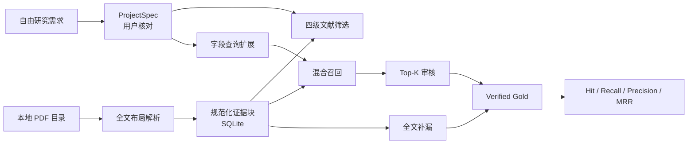

# 系统架构与数据流

## 1. 版本边界

MVP 1.1 只解决到“可量化的证据召回评估”。M2 的首个切片进一步把向量编码器改造成带版本元数据的可替换 backend，并记录检索参数与耗时；当前生产默认值仍是 hashing baseline，尚未接入真实神经模型或持久化向量索引。系统不生成最终科研数据，也不调用大模型编造摘要或数值。



## 2. 为什么全文解析但不保存 fulltext.jsonl

全文信息仍然被读取。区别在于存储单位：

- `documents` 只保存论文级元数据、解析状态和筛选结果。
- `blocks` 是唯一的全文事实来源，每条保存文本、页码、章节、类型和 PDF 坐标。
- 完整全文需要时按 `ordinal` 拼接 `blocks.text` 即可，不再复制一份大字符串。
- `gold_evidence` 只保存对证据块的引用。
- `retrieval_runs` 和 `evaluations` 保存版本化实验结果。单次召回还独立记录 retrieval backend、backend/model 版本、参数、查询数、语料块数和耗时；旧数据库通过只增列迁移保留原记录。

因此“全文可检索”和“避免重复存储”可以同时成立。数据库结构见
[database.py](../backend/database.py)。

## 3. 模块职责

| 模块 | 只负责什么 | 不负责什么 |
|---|---|---|
| [schemas.py](../backend/schemas.py) | API 与数据库之间的数据契约 | 业务判断 |
| [requirement_interpreter.py](../backend/requirement_interpreter.py) | 把自由描述拆成可核对字段 | 判断论文是否有数据 |
| [pdf_parser.py](../backend/pdf_parser.py) | 全文、布局、章节、caption、稳定 ID | OCR 扫描页 |
| [screening.py](../backend/screening.py) | `usable/relative/nodata/failed` 基线规则 | 最终人工结论 |
| [retrieval.py](../backend/retrieval.py) | Embedding backend 契约、查询扩展、BM25、向量相似度和排序 | 模型下载、持久化向量或最终数值抽取 |
| [evaluation.py](../backend/evaluation.py) | 对 verified Gold 计算指标 | 自动创造 Gold |
| [database.py](../backend/database.py) | SQLite 持久化和查询 | 页面展示 |
| [services.py](../backend/services.py) | 串联用例、哈希复用、重新筛选 | HTTP 细节 |
| [api.py](../backend/api.py) | HTTP 路由、错误转换、CORS | 复杂业务逻辑 |
| [page.tsx](../app/page.tsx) | 四阶段交互和人工审核 | PDF 算法 |

## 4. 全文解析

[pdf_parser.py](../backend/pdf_parser.py) 使用 `pdfplumber` 读取每页文本行和边界框，再按垂直间距、栏跳转、标题、caption 和最大长度合并成证据块。`pypdf` 负责页数和元数据兜底。

每个证据块包含：

```text
block_id, document_id, ordinal, page, section, kind, text, bbox
```

`block_id` 由 PDF 哈希、页码、顺序和文本计算，因此同一 PDF 在相同解析版本下可以稳定引用。PDF 哈希与 `parser_version` 决定是否复用；修改解析算法时应提升版本号。

当前已知边界：没有文字层的扫描 PDF 会进入 `failed`，需要后续 OCR 或人工处理。

## 5. 文献筛选

[screening.py](../backend/screening.py) 当前使用透明规则：

- `failed`：全文文本不足或解析失败。
- `usable`：目标附近存在数字/单位证据，且必须字段都有全文证据。
- `relative`：存在目标数值证据，但缺少一个或多个必须字段。
- `nodata`：能解析全文，但未发现满足规则的目标数值证据。

这里的结果是“进入人工审核的优先级”，不是论文最终标签。筛选依据会直接显示在页面上。

## 6. 召回不是黑箱

[retrieval.py](../backend/retrieval.py) 的基线分数为：

```text
0.45 × BM25
+ 0.35 × 字符 n-gram hashing 向量相似度
+ 0.15 × 术语覆盖
+ 0.05 × 章节先验
```

字符向量是可离线复现的 hashing baseline，不是神经网络 embedding。它的优势是没有模型下载、成本和网络依赖；劣势是语义泛化有限。`EmbeddingBackend` 现在要求每个实现暴露 backend、backend version、model、model version、维度、参数和是否为神经模型。`EvidenceRetriever` 通过该接口取得向量，因此后续领域 embedding 可以对同一证据块、查询、混合权重和 Gold 集运行。

API 返回当前 backend/model/version、完整参数和单次耗时，评估结果还返回总检索耗时、评估耗时、平均查询耗时以及逐查询的 Gold/top block ID。测试中的 `fixture-deterministic` 只验证接口替换和报告形状，不是神经模型，也不能作为神经检索收益证据。

真实模型接入后，持久化向量必须使用以下联合身份，任何一项变化都不得静默复用旧向量：

```text
document_sha256 + block_id + normalized_text_hash
+ backend + model + model_version
```

这正是 RAG 中的 Retrieval 层。当前没有 Generation 层，因为此阶段首先要证明正确证据能被召回。

## 7. Gold 和评估口径

每个评估查询由 `(document_id, field_name)` 定义。一条查询可以有多条 Gold 证据。

- `Hit@K`：Top-K 中是否至少出现一条 Gold。
- `Recall@K`：Top-K 命中的 Gold 数 / 该查询全部 Gold 数。
- `Precision@K`：Top-K 命中的 Gold 数 / 实际返回数。
- `MRR`：第一条 Gold 排名倒数的平均值。

必须用“全文补漏”找 Top-K 之外的相关证据，否则只审核 Top-K 会产生 verification bias，并虚高 Recall。

评估结果同时报告 Gold 数、查询数、论文数和字段数。覆盖太小时，即使指标是 100%，也不能代表整体性能。

## 8. 重建边界

| 修改内容 | 需要重新解析 PDF | 需要重新筛选 | 需要重跑召回/评估 |
|---|---:|---:|---:|
| 修改研究需求 | 否 | 是，自动 | 是 |
| 修改字段同义词 | 否 | 是 | 是 |
| 修改筛选规则 | 否 | 是 | 视情况 |
| 修改召回权重 | 否 | 否 | 是 |
| 修改 PDF 分块算法 | 是，并提升 parser version | 是 | 是 |
| 修改页面样式 | 否 | 否 | 否 |
| 替换 embedding 模型 | 否 | 否 | 是，并提升 retrieval version |
