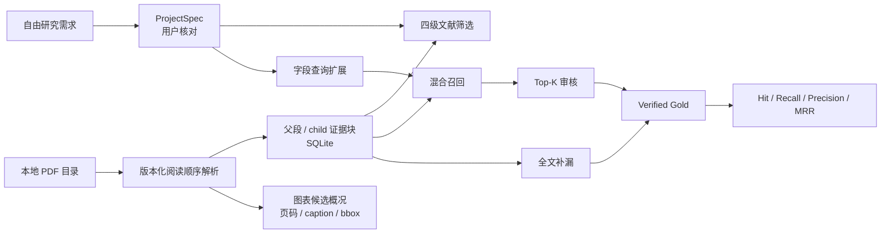

# 系统架构与数据流

## 1. 版本边界

MVP 1.1 只解决到“可量化的证据召回评估”。M2 已把向量编码器改造成带版本元数据的可替换 backend，记录检索参数与耗时，用 SQLite 安全缓存证据块向量，并提供 pinned `multilingual-e5-small` 本地神经 backend；默认值仍是 hashing baseline。系统不生成最终科研数据，也不调用大模型编造摘要或数值。



## 2. 为什么全文解析但不保存 fulltext.jsonl

全文信息仍然被读取。区别在于存储单位：

- `documents` 只保存论文级元数据、解析状态和筛选结果。
- `blocks` 是唯一的全文文本事实来源，每条保存规范化文本、原始文本、
  父段身份、child 序号、页码、章节、类型和 PDF 坐标。
- `visual_assets` 保存图、表和嵌入图像候选；它只描述“检测到什么、在
  哪里、是否可能数字化”，不把候选自动当成已验证科研数据。
- 完整全文需要时按 `ordinal` 拼接 `blocks.text` 即可，不再复制一份大字符串。
- `gold_evidence` 只保存对证据块的引用。
- `retrieval_runs` 和 `evaluations` 保存版本化实验结果。单次召回还独立记录 retrieval backend、backend/model 版本、参数、查询数、语料块数、耗时和缓存统计；旧数据库通过只增列迁移保留原记录。
- `embedding_vectors` 保存证据块向量和完整缓存身份。查询向量不持久化，每次请求实时生成。

因此“全文可检索”和“避免重复存储”可以同时成立。数据库结构见
[database.py](../backend/database.py)。

## 3. 模块职责

| 模块 | 只负责什么 | 不负责什么 |
|---|---|---|
| [schemas.py](../backend/schemas.py) | API 与数据库之间的数据契约 | 业务判断 |
| [requirement_interpreter.py](../backend/requirement_interpreter.py) | 把自由描述拆成可核对字段 | 判断论文是否有数据 |
| [pdf_parser.py](../backend/pdf_parser.py) | 文本层阅读顺序、父段/child chunk、图表候选、稳定 ID | OCR、图像理解或最终数字化 |
| [screening.py](../backend/screening.py) | `usable/relative/nodata/failed` 基线规则 | 最终人工结论 |
| [retrieval.py](../backend/retrieval.py) | Embedding/cache 契约、缓存身份、查询扩展、BM25、向量相似度和排序 | SQL、模型下载或最终数值抽取 |
| [embedding_backends.py](../backend/embedding_backends.py) | pinned E5 模型身份、lazy load、query/passage 前缀和本地运行时检查 | 混合排序、HTTP 或模型训练 |
| [evaluation.py](../backend/evaluation.py) | 对 verified Gold 计算指标 | 自动创造 Gold |
| [database.py](../backend/database.py) | SQLite 持久化和查询 | 页面展示 |
| [services.py](../backend/services.py) | 串联用例、哈希复用、重新筛选 | HTTP 细节 |
| [api.py](../backend/api.py) | HTTP 路由、错误转换、CORS | 复杂业务逻辑 |
| [page.tsx](../app/page.tsx) | 四阶段交互和人工审核 | PDF 算法 |

## 4. 全文解析、层级分块与图表概况

[pdf_parser.py](../backend/pdf_parser.py) 的默认 backend 是
`pdfplumber-reading-order-v2`。它先从定位单词重建文本行，把科学上下标
归回所在行，再用保守的页面中缝判断双栏；栏内从上到下、先左栏后右栏，
全宽标题作为阅读顺序锚点。跨页重复页眉页脚会在构造证据前移除。英文
断词、中英文换行、控制字符和常见 `CO2` / `Q10` 表达只在规范化文本中
修复，原始行文本仍单独保留。`pypdf` 负责页数和元数据兜底。

解析先生成完整父段，再将超过 680 字符的父段拆成目标约 480 字符、带
短句重叠的 child。检索只给 child 编码和排序，响应同时携带完整
`parent_context` 与同父段 child ID；人工 Gold 仍引用实际命中的 child
block。这样可以兼顾短 chunk 的定位精度和长上下文的可读性。

每个证据块包含：

```text
block_id, document_id, ordinal, page, section, kind, text, raw_text,
parent_id, parent_text, chunk_index, chunk_count, bbox
```

`block_id` 由父段身份、child 序号和 child 文本计算，因此同一 PDF 在相同
解析版本下可以稳定引用。PDF 哈希与 `parser_version` 决定是否复用；修改
解析算法时应提升版本号。重解析前数据库检查该论文已有 Gold；如果新输出
不能保留被引用的 block ID，事务会拒绝覆盖，防止级联删除人工事实。

图表概况合并三类弱信号：caption 文本、`pdfplumber` 表格边界以及 PDF
嵌入图像对象。每项记录类型、页码、caption、bbox、检测来源、置信度、
结构候选状态和 parser 版本。无 caption 的矢量图可能漏检，复杂线框也可能
被误判为表格，因此 UI 明确称其为“候选”和“待核对”。

当前已知边界：没有文字层的扫描 PDF 会进入 `failed`，需要后续 OCR 或人工
处理。Docling 尚未成为可运行 backend；引入前必须固定其模型 artifacts、
许可证、离线加载和资源基线，且不会替换当前轻量 parser 对照。

## 5. 文献筛选

[screening.py](../backend/screening.py) 当前使用透明规则：

- `failed`：全文文本不足或解析失败。
- `usable`：目标附近存在数字/单位证据，且必须字段都有全文证据。
- `relative`：存在目标数值证据，但缺少一个或多个必须字段。
- `nodata`：能解析全文，但未发现满足规则的目标数值证据。

这里的结果是“进入人工审核的优先级”，不是论文最终标签。筛选依据会直接显示在页面上。

## 6. 召回不是黑箱

[retrieval.py](../backend/retrieval.py) 的基线分数为：

```text
0.45 × BM25
+ 0.35 × 字符 n-gram hashing 向量相似度
+ 0.15 × 术语覆盖
+ 0.05 × 章节先验
```

上述基础分在 `references` 区段乘以可审计的 `0.25` hard-negative 系数，
避免引用标题因关键词密度挤占原始研究证据；该系数同时出现在响应分数组件
和 retrieval parameters 中，不会隐式删除参考文献 block。

字符向量是可离线复现的 hashing baseline，不是神经网络 embedding。它的优势是没有模型下载、成本和网络依赖；劣势是语义泛化有限。`EmbeddingBackend` 要求每个实现暴露 backend、backend version、model、model version、维度、参数和是否为神经模型，并分别批量编码 query 和 passages。`EvidenceRetriever` 通过该接口取得向量，因此 hashing 和神经模型可以对同一证据块、查询、混合权重和 Gold 集运行。

可选的 `MultilingualE5SmallEmbeddingBackend` 使用模型 commit `614241f622f53c4eeff9890bdc4f31cfecc418b3`、Sentence Transformers 5.5.1、Transformers 5.15.0 和 PyTorch 2.13.0。query 加 `query: `，证据块加 `passage: `，输出做 L2 归一化。对象创建和 health check 不加载模型；只有首次编码才从本地缓存加载，未缓存且允许下载时才访问 Hugging Face。论文文本和查询不会发送到推理 API。默认 backend 仍是 `hashing`，因此 core 安装和 CI 不需要这些大型依赖。

API 返回当前 backend/model/version、完整参数和单次耗时，评估结果还返回总检索耗时、评估耗时、平均查询耗时以及逐查询的 Gold/top block ID。测试中的 `fixture-deterministic` 只验证接口替换和报告形状，不是神经模型，也不能作为神经检索收益证据。

交互对比使用独立的 `POST /api/retrieve/compare` 编排入口。它固定同一篇论文、字段查询、Top K 和 verified Gold，依次运行三个可审计策略：BM25-only 使用 `1/0/0/0` 权重并完全跳过向量编码；hashing hybrid 和 E5 hybrid 使用相同的 `0.45/0.35/0.15/0.05` 权重，只替换向量 backend。每一路仍保存普通 `retrieval_runs`，并在参数中记录 `comparison_strategy`，所以交互面板不是脱离审计链的临时计算。E5 是可选能力；其依赖或固定模型不可用时，对比响应只把该策略标记为 unavailable，不会静默回退，也不影响另外两路。

持久化向量使用以下联合身份，任何一项变化都会生成新 cache key，不会静默复用旧向量：

```text
document_sha256 + block_id + normalized_text_hash
+ backend + backend_version + model + model_version
+ dimensions + embedding_parameters_hash + cache_key_version
```

检索层通过批量 cache 协议读取和写入整组 block；SQLite 实现位于 `database.py`，因此排序算法不依赖 SQL。冷缓存首次编码并写入，热缓存只重新编码 query。旧的不可达向量暂不自动删除，避免后台清理误删用户数据；后续若增加垃圾回收，必须提供明确范围和可恢复策略。

当前仍在单文档 block 集合上执行精确余弦扫描；`embedding_vectors` 是生成缓存而不是 ANN 向量数据库。是否引入 FAISS/HNSW 等索引必须由代表性语料的规模和延迟证据驱动。

这正是 RAG 中的 Retrieval 层。当前没有 Generation 层，因为此阶段首先要证明正确证据能被召回。

## 7. Gold 和评估口径

每个评估查询由 `(document_id, field_name)` 定义。一条查询可以有多条 Gold 证据。

- `Hit@K`：Top-K 中是否至少出现一条 Gold。
- `Recall@K`：Top-K 命中的 Gold 数 / 该查询全部 Gold 数。
- `Precision@K`：Top-K 命中的 Gold 数 / 实际返回数。
- `MRR`：第一条 Gold 排名倒数的平均值。

必须用“全文补漏”找 Top-K 之外的相关证据，否则只审核 Top-K 会产生 verification bias，并虚高 Recall。

网页允许从任意对比结果卡片直接标记 Gold，也可以在“全文补漏”中按关键词搜索或一次载入当前论文的全部证据块（API 明确上限 300）再逐条审核。这个入口减少了只看 Top-K 的偏差，但 Gold 的语义判断仍由人工负责；跨论文代表性、改写等价性和 hard-negative 的最终确认不能由待评估模型自行决定。

评估结果同时报告 Gold 数、查询数、论文数和字段数。覆盖太小时，即使指标是 100%，也不能代表整体性能。

## 8. 重建边界

| 修改内容 | 需要重新解析 PDF | 需要重新筛选 | 需要重跑召回/评估 |
|---|---:|---:|---:|
| 修改研究需求 | 否 | 是，自动 | 是 |
| 修改字段同义词 | 否 | 是 | 是 |
| 修改筛选规则 | 否 | 是 | 视情况 |
| 修改召回权重 | 否 | 否 | 是 |
| 修改 PDF 分块算法 | 是，并提升 parser version | 是 | 是 |
| 修改页面样式 | 否 | 否 | 否 |
| 替换 embedding 模型 | 否 | 否 | 是，并提升 retrieval version |
